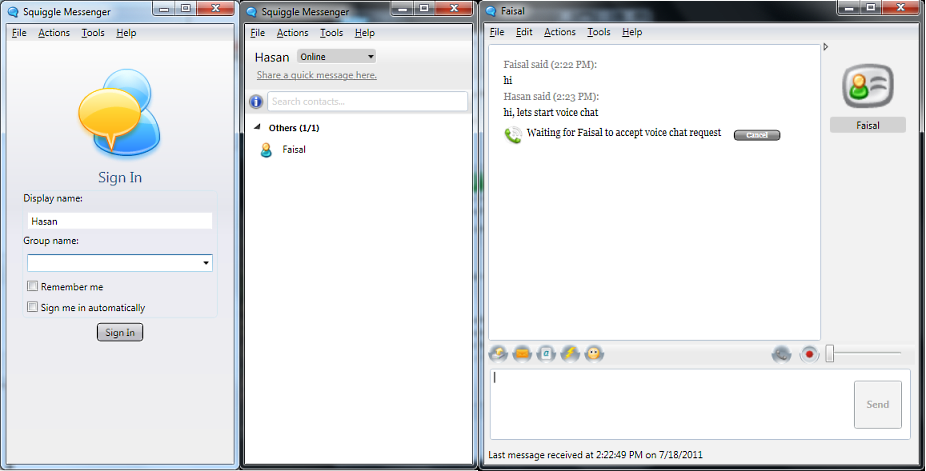

Squiggle is a free server-less peer to peer LAN messenger.
Just download and run it and you're ready to talk to everyone on your LAN.

**Key Features:**

* Server-less peer to peer LAN chat, No installation required. Just download, unzip and run
* Group chat, Broadcast chat and Private chat
* Bridge for connecting two LANs across subnets or WAN.
* Supports localization i.e. you can replace the translation file to use Squiggle in your native language.
* Fast (multiple) file transfer
* Spell Check, Buzz, Emoticons, Audio Alerts, Tray Popups
* Contact groups, Display message, Display Pic, Chat commands, Message aliases
* Chat history, Status history
* **Voice Chat**

Server-less LAN Chat software that is easy to use and has a nice UI.

 

[System Requirements](System-Requirements)

Follow us on twitter [http://twitter.com/overroot](http://twitter.com/overroot)
[http://www.overroot.com](http://www.overroot.com)
